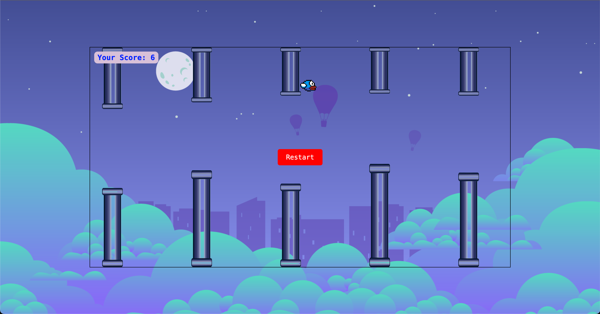

# Flappy Bird

A simple Flappy Bird-style game built using HTML, CSS, and JavaScript. The game features a bird that the player must navigate through gaps in pipes by making it jump. The goal is to score as many points as possible without colliding with the pipes.



---

## Features

- **Responsive Design**: Works on both desktop and mobile devices.
- **Dynamic Pipe Generation**: Pipes are generated at random heights and intervals.
- **Score Tracking**: The player's score increases as they successfully navigate through pipes.
- **Game Over Screen**: Displays the final score and allows the player to restart the game.

---

## How to Play

1. **Start the Game**: Click the "Play" button to begin.
2. **Make the Bird Jump**: Press the **Spacebar** (on desktop) or tap the screen (on mobile) to make the bird jump.
3. **Avoid Pipes**: Navigate the bird through the gaps in the pipes.
4. **Score Points**: Each successful pass through a pair of pipes increases your score.
5. **Game Over**: The game ends if the bird collides with a pipe or the ground. Click "Restart" to play again.

---

## Installation and Setup

1. **Clone the Repository**:
   ```bash
   git clone https://github.com/mehrnazsadrol/flappy-bird.git
   cd flappy-bird
